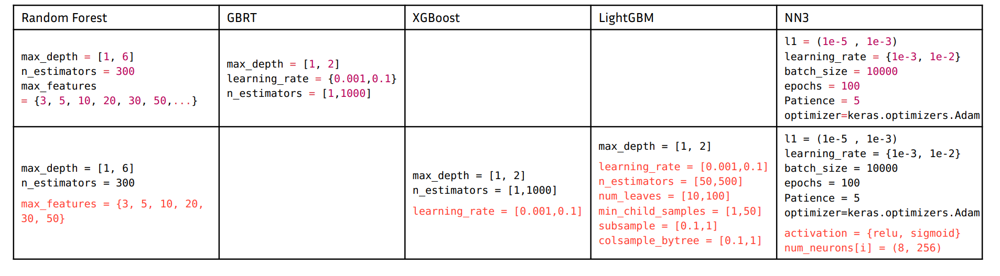
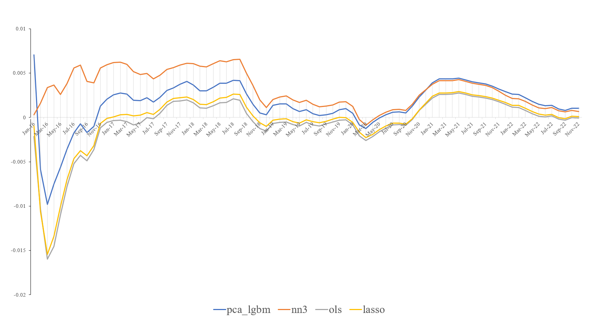

# StockProject ReadME

_黎睿 2020201623_
_2023.06.16_

# 目标

- StockProject旨在使用机器学习方法，通过股票市场过去的历史数据，对未来的股票收益率（return）进行尽可能精确的预测。
- 此项目同可视为如下论文的复现:_Shihao Gu and others, Empirical Asset Pricing via Machine Learning, The Review of Financial Studies, Volume 33, Issue 5, May 2020, Pages 2223–2273, https://doi.org/10.1093/rfs/hhaa009_

# 股票数据来源

项目所使用的股票数据来自两部分：

## WRDS数据库

链接方式：

```
import wrds  
conn = wrds.Connection()  
```

数据库调用样例代码：

```
crsp_bid = conn.raw_sql("""  
                    select a.permno, a.date, a.ret, (a.ret - b.rf) as exret, a.askhi, a.bidlo  
                    from crsp.dsf as a  
                    left join ff.factors_daily as b  
                    on a.date=b.date  
                    where a.date > '01/01/2013'  
                    """)  

```

## 何欣的Github项目

https://feng-cityuhk.github.io/EquityCharacteristics/ ：用于计算个股和组合在资产特征方面的指标 （计算因子）

## 项目中的数据地址

`/home/mw/input/stock3636/chars60_rank_imputed.feather`

# 股票数据

- 时间跨度：2013.05 - 2022.12
- 变量个数：63  （_Gu (2020)_ 数据共含94个变量）

```python
import pyarrow.feather as feather

#导入数据
with open('/home/mw/input/stock3636/chars60_rank_imputed.feather', 'rb') as f:
    data = feather.read_feather(f)
data['date'] = data['date'].astype('datetime64')

data
```


<div>
<table border="1" class="dataframe">
  <thead>
    <tr style="text-align: right;">
      <th></th>
      <th>gvkey</th>
      <th>permno</th>
      <th>sic</th>
      <th>ret</th>
      <th>exchcd</th>
      <th>shrcd</th>
      <th>date</th>
      <th>ffi49</th>
      <th>lag_me</th>
      <th>rank_acc</th>
      <th>...</th>
      <th>rank_baspread</th>
      <th>rank_sue</th>
      <th>rank_grltnoa</th>
      <th>rank_std_turn</th>
      <th>rank_depr</th>
      <th>rank_cinvest</th>
      <th>rank_op</th>
      <th>rank_agr</th>
      <th>rank_ep</th>
      <th>log_me</th>
    </tr>
  </thead>
  <tbody>
    <tr>
      <th>0</th>
      <td>1004</td>
      <td>54594</td>
      <td>5080</td>
      <td>0.106233</td>
      <td>1.0</td>
      <td>11.0</td>
      <td>2013-07-31</td>
      <td>42</td>
      <td>8.733313e+05</td>
      <td>0.000000</td>
      <td>...</td>
      <td>-0.228856</td>
      <td>0.000000</td>
      <td>0.000000</td>
      <td>-0.668317</td>
      <td>0.000000</td>
      <td>0.000000</td>
      <td>0.000000</td>
      <td>0.000000</td>
      <td>0.000000</td>
      <td>13.680070</td>
    </tr>
    <tr>
      <th>1</th>
      <td>1004</td>
      <td>54594</td>
      <td>5080</td>
      <td>0.035066</td>
      <td>1.0</td>
      <td>11.0</td>
      <td>2013-08-31</td>
      <td>42</td>
      <td>9.501110e+05</td>
      <td>0.000000</td>
      <td>...</td>
      <td>-0.013203</td>
      <td>0.000000</td>
      <td>0.000000</td>
      <td>-0.408898</td>
      <td>0.000000</td>
      <td>0.000000</td>
      <td>0.000000</td>
      <td>0.000000</td>
      <td>0.000000</td>
      <td>13.764334</td>
    </tr>
    <tr>
      <th>2</th>
      <td>1004</td>
      <td>54594</td>
      <td>5080</td>
      <td>0.089279</td>
      <td>1.0</td>
      <td>11.0</td>
      <td>2013-09-30</td>
      <td>42</td>
      <td>9.834276e+05</td>
      <td>0.000000</td>
      <td>...</td>
      <td>0.363164</td>
      <td>-0.468880</td>
      <td>0.000000</td>
      <td>-0.401991</td>
      <td>0.000000</td>
      <td>0.000000</td>
      <td>0.000000</td>
      <td>0.000000</td>
      <td>0.000000</td>
      <td>13.798799</td>
    </tr>
    <tr>
      <th>3</th>
      <td>1004</td>
      <td>54594</td>
      <td>5080</td>
      <td>0.074094</td>
      <td>1.0</td>
      <td>11.0</td>
      <td>2013-10-31</td>
      <td>42</td>
      <td>1.081776e+06</td>
      <td>0.000000</td>
      <td>...</td>
      <td>-0.698288</td>
      <td>-0.284507</td>
      <td>0.000000</td>
      <td>0.332380</td>
      <td>0.000000</td>
      <td>0.000000</td>
      <td>0.000000</td>
      <td>0.000000</td>
      <td>0.000000</td>
      <td>13.894115</td>
    </tr>
    <tr>
      <th>4</th>
      <td>1004</td>
      <td>54594</td>
      <td>5080</td>
      <td>0.066257</td>
      <td>1.0</td>
      <td>11.0</td>
      <td>2013-11-30</td>
      <td>42</td>
      <td>1.159195e+06</td>
      <td>0.000000</td>
      <td>...</td>
      <td>0.113014</td>
      <td>-0.249838</td>
      <td>0.000000</td>
      <td>0.249859</td>
      <td>0.000000</td>
      <td>0.000000</td>
      <td>0.000000</td>
      <td>0.000000</td>
      <td>0.000000</td>
      <td>13.963237</td>
    </tr>
    <tr>
      <th>...</th>
      <td>...</td>
      <td>...</td>
      <td>...</td>
      <td>...</td>
      <td>...</td>
      <td>...</td>
      <td>...</td>
      <td>...</td>
      <td>...</td>
      <td>...</td>
      <td>...</td>
      <td>...</td>
      <td>...</td>
      <td>...</td>
      <td>...</td>
      <td>...</td>
      <td>...</td>
      <td>...</td>
      <td>...</td>
      <td>...</td>
      <td>...</td>
    </tr>
    <tr>
      <th>409275</th>
      <td>349972</td>
      <td>15642</td>
      <td>2836</td>
      <td>-0.112676</td>
      <td>3.0</td>
      <td>11.0</td>
      <td>2022-08-31</td>
      <td>13</td>
      <td>2.345556e+04</td>
      <td>-0.444488</td>
      <td>...</td>
      <td>0.739678</td>
      <td>0.741955</td>
      <td>-0.609195</td>
      <td>0.973928</td>
      <td>0.971420</td>
      <td>0.962517</td>
      <td>-0.660321</td>
      <td>-0.597799</td>
      <td>-0.793579</td>
      <td>10.062863</td>
    </tr>
    <tr>
      <th>409276</th>
      <td>349972</td>
      <td>15642</td>
      <td>2836</td>
      <td>-0.142857</td>
      <td>3.0</td>
      <td>11.0</td>
      <td>2022-09-30</td>
      <td>13</td>
      <td>2.081268e+04</td>
      <td>-0.455121</td>
      <td>...</td>
      <td>-0.042951</td>
      <td>0.736685</td>
      <td>-0.612265</td>
      <td>0.225547</td>
      <td>0.971920</td>
      <td>0.962426</td>
      <td>-0.657766</td>
      <td>-0.596149</td>
      <td>-0.818037</td>
      <td>9.943318</td>
    </tr>
    <tr>
      <th>409277</th>
      <td>349972</td>
      <td>15642</td>
      <td>2836</td>
      <td>-0.152778</td>
      <td>3.0</td>
      <td>11.0</td>
      <td>2022-10-31</td>
      <td>13</td>
      <td>1.783944e+04</td>
      <td>-0.455197</td>
      <td>...</td>
      <td>-0.092155</td>
      <td>0.736937</td>
      <td>-0.609950</td>
      <td>0.071356</td>
      <td>0.971693</td>
      <td>0.961642</td>
      <td>-0.652667</td>
      <td>-0.605868</td>
      <td>-0.803481</td>
      <td>9.789167</td>
    </tr>
    <tr>
      <th>409278</th>
      <td>349972</td>
      <td>15642</td>
      <td>2836</td>
      <td>-0.004754</td>
      <td>3.0</td>
      <td>11.0</td>
      <td>2022-11-30</td>
      <td>13</td>
      <td>1.511397e+04</td>
      <td>0.916506</td>
      <td>...</td>
      <td>-0.264802</td>
      <td>0.132331</td>
      <td>-0.635952</td>
      <td>-0.534522</td>
      <td>-0.972564</td>
      <td>0.968094</td>
      <td>-0.895235</td>
      <td>0.885776</td>
      <td>-0.803432</td>
      <td>9.623375</td>
    </tr>
    <tr>
      <th>409279</th>
      <td>349972</td>
      <td>15642</td>
      <td>2836</td>
      <td>-0.203865</td>
      <td>3.0</td>
      <td>11.0</td>
      <td>2022-12-31</td>
      <td>13</td>
      <td>1.504212e+04</td>
      <td>0.918573</td>
      <td>...</td>
      <td>-0.866295</td>
      <td>0.132388</td>
      <td>-0.634946</td>
      <td>-0.607269</td>
      <td>-0.973056</td>
      <td>0.968466</td>
      <td>-0.894276</td>
      <td>0.888649</td>
      <td>-0.784222</td>
      <td>9.618609</td>
    </tr>
  </tbody>
</table>
<p>409280 rows × 64 columns</p>
</div>

# 模型及预测

## 模型

此项目中，我们共使用：

- `OLS`,`LASSO`
- `RF`,`XGboost`,`LightGBM`，`pca+LightGBM`
- `NN3`

## 超参列表



（**Remark：** 第一行的超参为_Gu(2020)_中使用的超参。第二行的超参为本项目使用的超参。与_Gu(2020)_相同的超参由黑色表示，与_Gu(2020)_不同的超参用红色表示）

## 模型评估

我们使用样本外R方（记做$R_{OOS}^2$）做为模型效果好坏的评估指标：

$R_{OOS}^2 =  1 - \frac{\sum_{it} (ret_{it} -\hat{ret}^2_{it}) }{\sum_{it} ret_{it}^2}$

这里$\hat{ret}_{it}$代表模型预测的第$i$只股票在$t$时期的收益率（return）

结果呈现如下：



# 文件结构

`StockProject`共有四个文件夹：

- 其中 `code`文件夹记录了项目使用的模型及对应的代码：
-`OLS`,`Lasso`
-`RF`,`Xgboost`,`Lightgbm`,`PCA+Lightgbm`
-`NN3`
-`NN and AutoEncoder in Pytorch`则记录了使用`pytorch`框架搭建的`NN`和`AutoEncoder`代码
- `image`文件夹则用于保存`ReadME.md`使用的图片文件
- `Result`:记录了不同模型在不同时期的$R_{OOS}^2$
- `slide`：为课堂展示用的pdf文件
